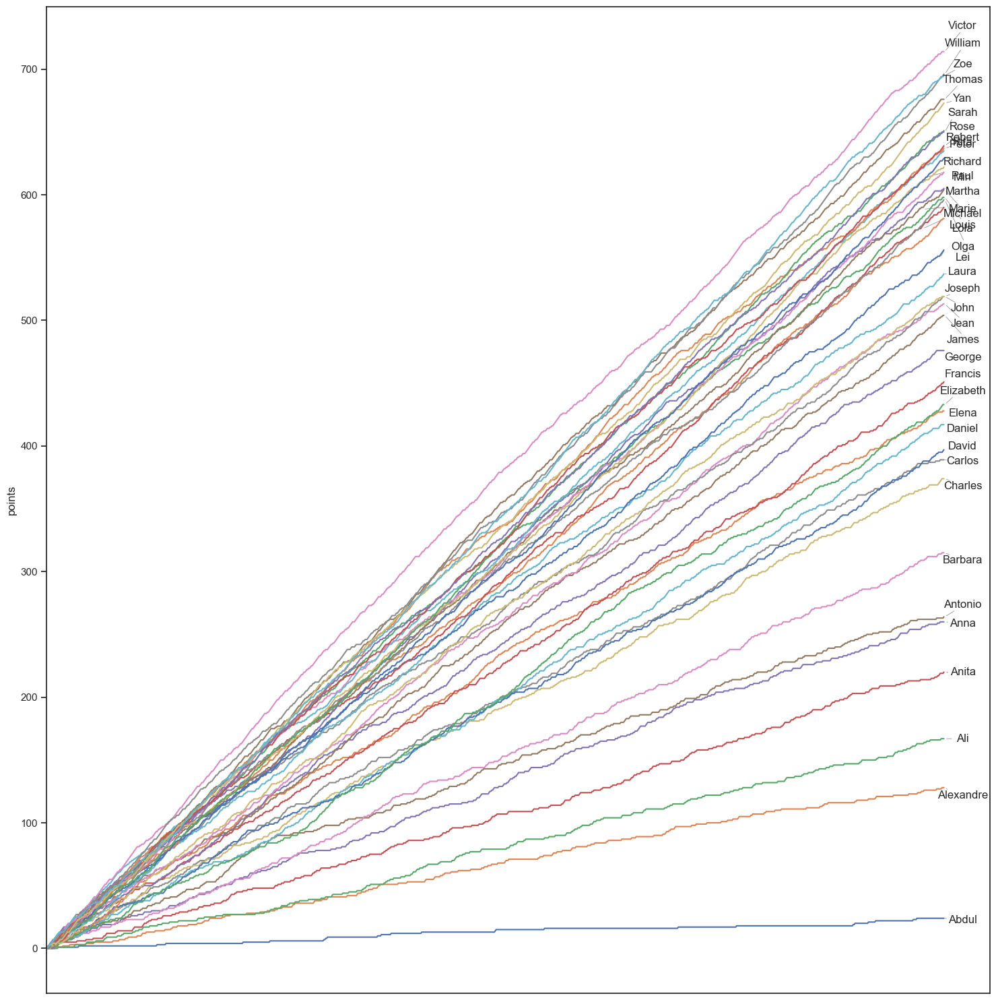
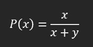
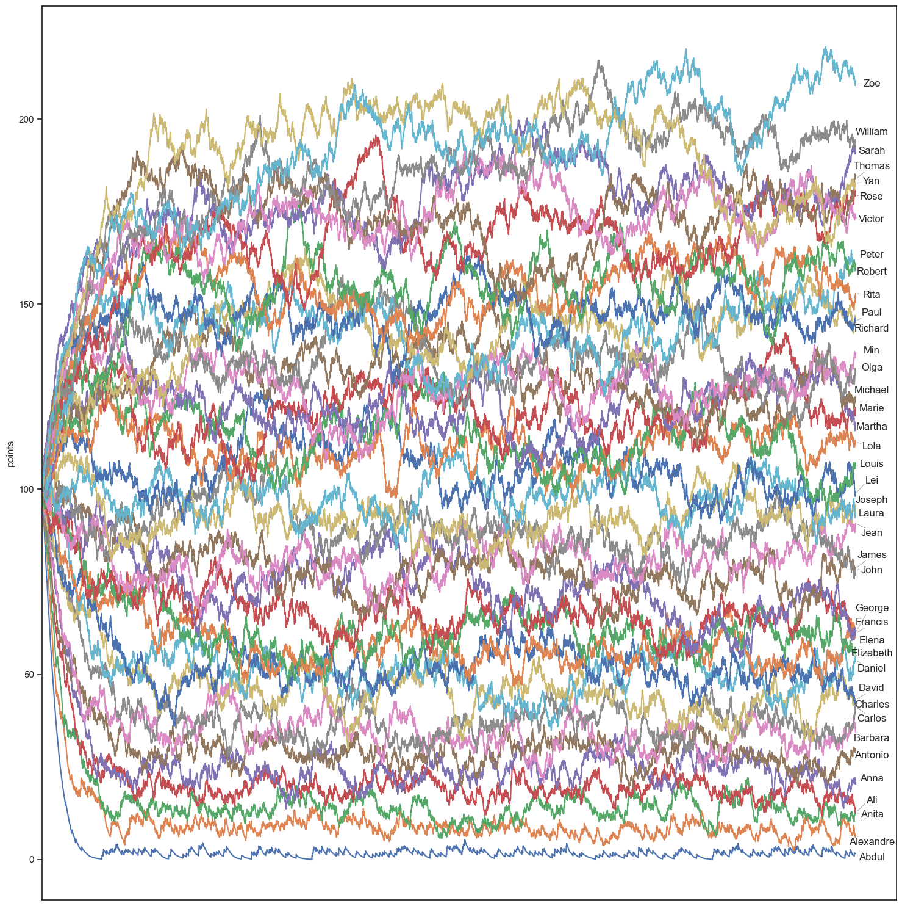
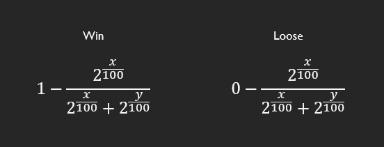
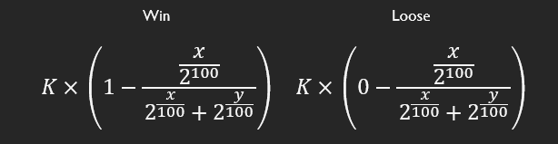
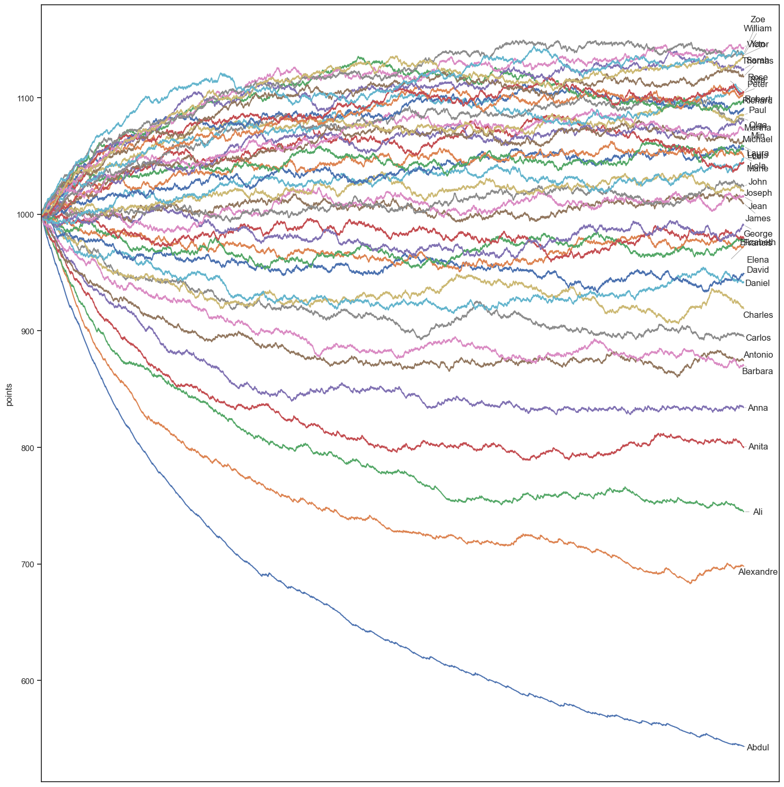

    
 # ELO Ratings system

click [here](https://github.com/colinldt/Elo_rating_system/blob/main/elo_rating_system.ipynb) to see the full code
    
## Description

Let’s imagine a game with 40 participants. To keep things simple, their actual performance is based on alphabetical order, so Abdul is the weakest player and Zoe the strongest. 

## Basic system

Let's start by just giving 1 point to the winner and 0 to the looser. 

It works, best player have the most points but we'va overlooked the balance here. Let's adjust our formula by the win rate of our players.

## Points adjustment system based on winrate

The expected win rate is then given by the following formula:

X represent the skill of the first player and Y the second one.

The winner get 1 - P(x) and looser 0 - P(x)

Great ! The foundation of our Elo system works, but a small improvement would help make it easier to compare players’ actual skill levels, let's correlate the difference in points with the difference in skill.

## Adjusted system of visualization of skill in relation to the difference of points

Let's take our formula so that a difference of 100 points symbolizes a skill 2 times higher (or lower) than another player. Our new formula for calculating points will be this:

## Going further

When analysing these curves, we notice an initial balancing phase that lasts for about 1,600 games, after which the ratings tend to stabilize around each player's true level.
We can accelerate this by multiplying our points by a factor K > 1 like so:

However, each player's score will now be much more volatile and that’s expected, since their gains and losses are amplified. But we can simply take into account the number of matches already played.Then, as they play more matches, the K-factor will gradually decrease, allowing their rating to be fine-tuned and better reflect their true performance.
